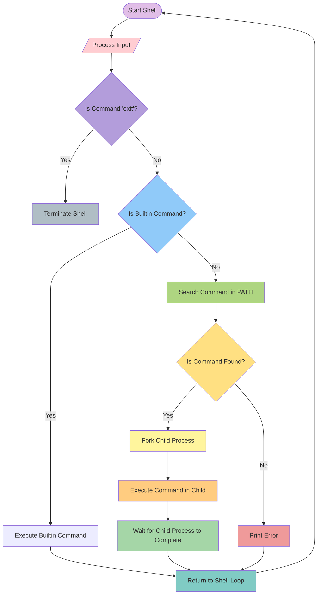

## Simple Shell Project

**Project Description:** 
The Simple Shell is a basic command-line interpreter built as part of the Holberton School curriculum. It emulates some of the core functionalities of the Unix shell, allowing users to execute commands, navigate directories, and interact with the system through a terminal interface.

## Table of Contents
- [Introduction](#introduction)
- [Examples](#examples)
- [Files](#files)
- [Functions](#functions)
- [Limitations](#limitations)
- [Documentation](#documentation)
- [Environment](#environment)
- [Installation](#installation)
- [Authors](#authors)
- [FlowChart](#flowchart)

## Introduction
The Simple Shell project was developed to provide a hands-on understanding of how a Unix-like shell operates. It focuses on executing simple commands, handling basic input/output, and managing processes. This shell supports essential functionalities such as changing directories, listing environment variables, and exiting the shell. The project offers insight into the underlying mechanics of shell operations, including command parsing, process control, and system calls.

This shell is designed for educational purposes, providing a fundamental foundation for understanding more complex shell features and the general workings of command-line interfaces.

## Examples

Here are some examples of commands you can run in the Simple Shell:

**Running a simple command**:
*      $ ls (Output: Lists the files and directories
                    in the current working directory)

**Changing the directory:**
*      $ cd /path/to/directory
       Output: Changes the current directory to the specified path.

**Printing the current directory:**
*      $ pwd 
       Output: Displays the current working directory

**Running a command with arguments:**
*     $ ls -l /home
      Output: Lists the files and directories in /home in long format.

**Printing environment variables:**
*     $ env
      Output: Displays the current environment variables.

**Exiting the shell:**
*      $ exit
       Output: Exits the Simple Shell.

## Files

* main.c: Contains the main function, which starts the shell loop.
* shell.c: Implements the main shell functions, including the command loop, command execution, and built-in commands.
* shell.h: The header file containing all function prototypes and necessary libraries.

## Functions
* shell_loop(): The main loop of the shell.
* read_line(): Reads a line of input from the user.
* split_line(): Splits the input line into tokens (command and arguments).
* execute_command(): Executes the user's command, handling both built-in and external commands.
* shell_cd(): Implements the cd command to change directories.

## Limitations
* The shell does not handle command pipelines (|), redirections (>, <), or background execution (&).
* Commands must be entered one at a time.
* The shell does not support non-interactive mode (e.g., piping commands from a file or another program).

## Documentation

[Documentation Betty style ](https://github.com/alx-tools/Betty/wiki)

[Documentation Man page ](https://github.com/IrenBod/holbertonschool-simple_shell/blob/main/man_1_simple_shell)

## Environment
Language: C

OS: Ubuntu 20

Compiler: gcc 13.2.0

Style guidelines: Betty style

## Installation

Clone the repository 
Install with gcc

```bash
git clone https://github.com/IrenBod/holbertonschool-simple_shell.git

# Navigate to the project directory:
cd holbertonschool-simple_shell

# Compile the source code:
gcc -Wall -Werror -Wextra -pedantic -std=gnu89 *.c -o hsh

# Start the shell:
./hsh


    
## Authors

@IrinaMora https://github.com/IrenBod 

## FlowChart

